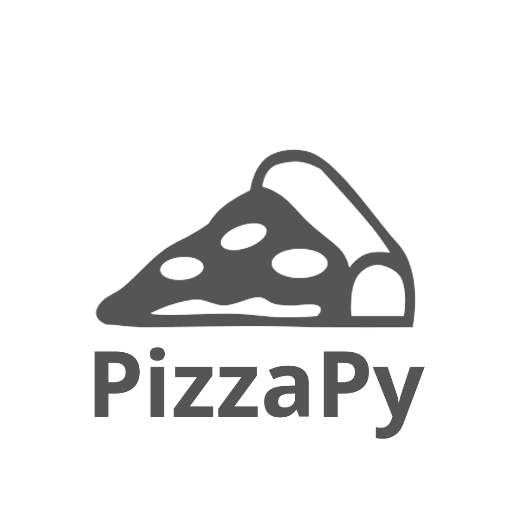
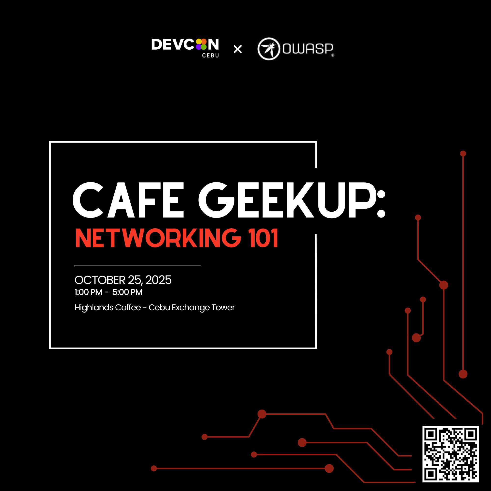
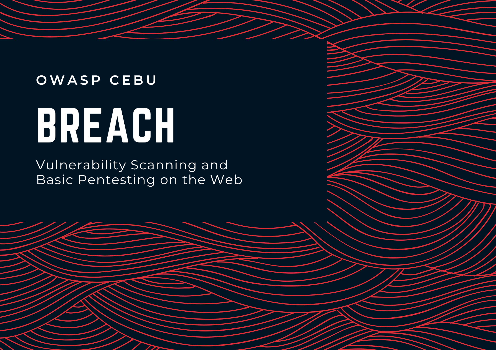
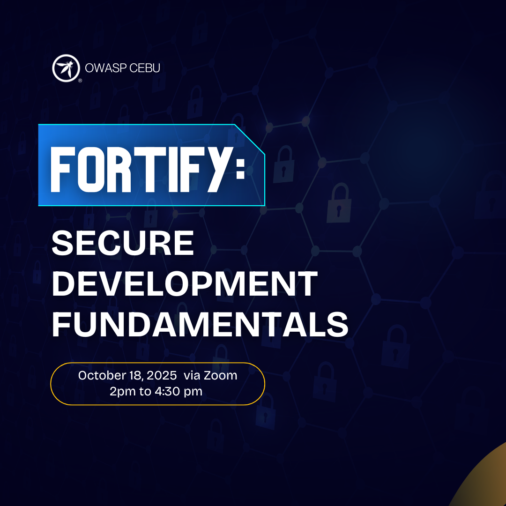

---

layout: col-sidebar
title: OWASP Cebu
tags: tech-community
region: Asia
country: Philippines
meetup-group: 

---

  

The OWASP Cebu City Chapter is a local community dedicated to web application security in Cebu City, Philippines. As part of the global Open Web Application Security Project (OWASP) Foundation, this chapter brings together cybersecurity professionals, developers, educators, and enthusiasts to share knowledge and promote better security practices.

## Welcome to OWASP Cebu City

Welcome to the OWASP Cebu City Chapter! We are a dynamic community of cybersecurity professionals, developers, students, and enthusiasts dedicated to improving web application security in Cebu City and throughout the Philippines.

Our chapter focuses on knowledge-sharing, skills development, and building a strong network of security-minded individuals in the region. We organize regular meetups, workshops, and training sessions that address both fundamental and advanced security concepts.

Whether you're a seasoned security professional or just beginning your journey in application security, OWASP Cebu City provides a welcoming environment to learn, contribute, and connect with like-minded individuals.

Join us at our next event to be part of the growing cybersecurity community in Cebu!

## Participation
The Open Worldwide Application Security Project (OWASP) is a nonprofit foundation that works to improve the security of software. All of our projects, tools, documents, forums, and chapters are free and open to anyone interested in improving application security. 

Chapters are led by local leaders in accordance with the [Chapters Policy](/www-policy/operational/chapters). Financial contributions should only be made online using the authorized online donation button. 

Everyone is welcome and encouraged to participate in our [Projects](/projects/), [Local Chapters](/chapters/), [Events](/events/), [Online Groups](https://groups.google.com/a/owasp.com/){:target='_blank'}, and [Community Slack Channel](https://owasp.slack.com/){:target='_blank'}. We especially encourage diversity in all our initiatives. OWASP is a fantastic place to learn about application security, to network, and even to build your reputation as an expert. We also encourage you to be [become a member](/membership/) or consider a [donation](/donate/) to support our ongoing work.

---

## Blog & Resources

  
  <h3 style="margin: 15px 0; font-size: 1.5em;">Read Our Blog</h3>
  
Stay updated with the latest security insights, tutorials, and event recaps from OWASP Cebu.

  <a href="https://medium.owasp-cebu.org" target="_blank" rel="noopener noreferrer" style="display: inline-block; padding: 12px 30px; background-color: #000; color: #fff; text-decoration: none; border-radius: 6px; font-weight: bold; margin-top: 10px; transition: background-color 0.3s;">Visit Our Medium Blog →</a>

---

<!-- Community Partners Section for OWASP Cebu -->
<section>
  <h2>Community Partners</h2>
  
  
We are proud to collaborate with various community partners who support our mission to enhance web application security in Cebu.

  
  

    <!-- JavaScript Cebu -->
    

      

        
      

      <h3 style="margin: 10px 0; text-align: center; font-size: 1.2em;">JavaScript Cebu</h3>
      
<a href="https://www.jscebu.org/" target="_blank" rel="noopener noreferrer" style="color: #2563eb; text-decoration: none; font-weight: 500;">Visit JS Cebu →</a>

    

    <!-- PizzaPy Cebu -->
    

      

        
      

      <h3 style="margin: 10px 0; text-align: center; font-size: 1.2em;">PizzaPy - Cebu Python Users Group</h3>
      
<a href="https://www.pizzapy.ph/" target="_blank" rel="noopener noreferrer" style="color: #2563eb; text-decoration: none; font-weight: 500;">Visit PizzaPy PH →</a>

    

    <!-- DEVCON Cebu -->
    

      

        
      

      <h3 style="margin: 10px 0; text-align: center; font-size: 1.2em;">DEVCON Cebu</h3>
      
<a href="https://devcon.ph/cebu/" target="_blank" rel="noopener noreferrer" style="color: #2563eb; text-decoration: none; font-weight: 500;">Visit DEVCON Cebu →</a>

    

  

</section>

---

## Next Meeting/Event

  <h3 style="color: white; margin-top: 0; font-size: 1.8em;">🎯 Café GeekUp: Networking 101</h3>
  

    
<strong>📅 Date:</strong> October 25, 2025

    
<strong>⏰ Time:</strong> 1:00 PM – 5:00 PM

    
<strong>📍 Venue:</strong> Highlands Coffee, Cebu Exchange Tower

    
<strong>🤝 Co-hosted with:</strong> DEVCON Cebu

  

  
  

    
  

  
  
A collaborative study huddle focused on networking fundamentals and security essentials. Learn how networks work, why security matters, and how these fundamentals form the backbone of today's tech landscape. Perfect for beginners and those refreshing their basics.

---

## Past Events

### 2025

  

    
✅ HELLO CEBU! Introduction to OWASP and OWASP Cebu

  

  
  

    
✅ Capture the Flag #1 - Web Exploitation & General Skills Series

  

  
  

    
✅ Capture the Flag #2 - Web Exploitation & General Skills Series

  

  
  

    
✅ Capture the Flag #3 - Web Exploitation & General Skills Series

  

  <h3 style="color: #2563eb; margin-top: 0;">✅ BREACH - Application Security Breaches and Defense Strategies</h3>
  
<strong>📅 Date:</strong> July 27, 2025

  
<strong>📍 Venue:</strong> iAcademy Cebu

  
  

    
  

  
  
An exciting cybersecurity event focusing on application security breaches and defense strategies, providing insights into real-world security incidents and how to protect against them.

  <h3 style="color: #2563eb; margin-top: 0;">✅ FORTIFY: Secure Development Fundamentals</h3>
  
<strong>📅 Date:</strong> October 18, 2025

  
<strong>📍 Venue:</strong> Zoom Webinar (2pm to 4:30pm)

  
<strong>📚 Topics:</strong> AppSec Landscape, Case Studies, and OWASP ASVS

  
  

    
  

  
  
A comprehensive webinar covering the application security landscape, real-world case studies, and an introduction to the OWASP Application Security Verification Standard (ASVS) for building secure applications.

---

  <h3 style="color: white; font-size: 1.8em; margin-bottom: 15px;">Join Our Community!</h3>
  
Connect with cybersecurity professionals and enthusiasts in Cebu

  

    <a href="https://medium.owasp-cebu.org" target="_blank" rel="noopener noreferrer" style="display: inline-block; padding: 12px 25px; background-color: white; color: #2d2d2d; text-decoration: none; border-radius: 6px; font-weight: bold;">📝 Read Our Blog</a>
    <a href="/membership/" style="display: inline-block; padding: 12px 25px; background-color: rgba(255,255,255,0.2); color: white; text-decoration: none; border-radius: 6px; font-weight: bold; border: 2px solid white;">🤝 Become a Member</a>
  

